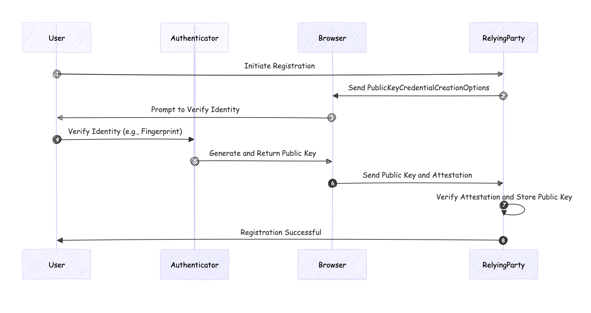

# Passwordless WebAuthn Demo with py_webauthn  
[](https://github.com/barrychum/passwordless-demo/actions/workflows/deploy.yml)

This project demonstrates a basic implementation of a WebAuthn Relying Party (RP) using the [py_webauthn](https://github.com/duo-labs/py_webauthn) library, showcasing passwordless account registration and authentication.  

This is also a very basic CI/CD demonstration from pushing a source to github, validate the code, push the code to railway.app, build and finally deploy the application which can be access via the Internet.

## Why WebAuthn?

WebAuthn (Web Authentication) is a game-changing web standard that enables passwordless, phishing-resistant authentication. This demo illustrates how easily it can be implemented, paving the way for more secure and user-friendly web applications.


## WebAuthn vs Traditional Authentication

https://www.cisa.gov/sites/default/files/publications/fact-sheet-implementing-phishing-resistant-mfa-508c.pdf


### Comparison of Phishing-Resistant MFA vs. Traditional Authentication

| **Feature**                        | **Phishing-Resistant MFA**                        | **Traditional Authentication (2FA)**            |
|------------------------------------|---------------------------------------------------|-------------------------------------------------|
| **Security Level**                 | High                                              | Moderate to High                                |
| **Method**                         | Public key cryptography (e.g., WebAuthn)           | Passwords + OTP (SMS, Email, Authenticator Apps) |
| **Resistance to Phishing**         | Strong (prevents phishing attacks)                | Varies (weaker against phishing, especially SMS/Email) |
| **Ease of Use**                    | High (passwordless)                               | Moderate (requires additional steps)            |
| **Implementation Complexity**      | Moderate to High (requires modern setup)          | Low to Moderate                                 |
| **User Experience**                | Seamless (often single-step)                      | Multiple steps (password + OTP)                 |
| **Examples**                       | FIDO, WebAuthn                                     | SMS OTP, Email OTP, Authenticator Apps          |

This table highlights key differences, showing how phishing-resistant MFA provides enhanced security and user experience compared to traditional methods.


## Features

- Passwordless account registration and authentication using WebAuthn
- Simple Python backend with Flask
- Basic frontend demonstrating WebAuthn API usage

## Demo

Please visit this url to see it in actions. The demo shows the details of the requests, responses in each step of the process.  This can be very helpful to understand how it works.  

https://barryc.eu.pythonanywhere.com/

The user database will be reset half-daily.  

#### WebAuthn process
WebAuthn (Web Authentication) is a standard for secure authentication on the web using public key cryptography. The process involves multiple steps to ensure a secure and user-friendly authentication mechanism. Here are the key steps involved in the WebAuthn process:

##### 1. Registration (or Enrollment) Process:


a. User Initiates Registration
- The user starts the registration process on a website (relying party) that supports WebAuthn.

b. Relying Party Requests Credentials
- The relying party generates a `PublicKeyCredentialCreationOptions` object that contains challenge data, relying party information, user information, and other parameters required for the credential creation.

c. User Verifies and Creates Credentials
- The browser, which supports WebAuthn, prompts the user to verify their identity using an authenticator (e.g., a fingerprint sensor, security key, or facial recognition).
- The authenticator generates a new key pair (public and private keys).
- The private key is stored securely on the authenticator, while the public key and other relevant data (like the attestation) are sent back to the relying party.

d. Relying Party Verifies Registration
- The relying party verifies the received attestation object and the associated public key.
- If the verification is successful, the public key is stored in the user’s account for future authentications.

##### 2. Authentication (or Login) Process:

a. User Initiates Login
- The user initiates the login process on the website.

b. Relying Party Requests Assertion
- The relying party generates a `PublicKeyCredentialRequestOptions` object that includes a challenge and other relevant parameters.
- This is sent to the browser to begin the authentication process.

c. User Verifies Identity
- The browser prompts the user to verify their identity using the previously registered authenticator.
- The authenticator signs the challenge using the stored private key.

d. Authenticator Returns Assertion
- The authenticator returns the signed assertion (which includes the signed challenge and other data) to the browser.
- The browser sends this assertion back to the relying party.

e. Relying Party Verifies Assertion
- The relying party verifies the signed assertion using the stored public key.
- If the verification is successful, the user is authenticated and granted access to their account.

#### Key Components:
- **Authenticator**: A device or software that generates and stores key pairs, and performs cryptographic operations.
- **Browser**: The user’s browser or web application that facilitates the WebAuthn process.
- **Relying Party**: The website or service that requests and verifies the user’s credentials.

#### Security Features:
- **Challenge-Response Mechanism**: Ensures that each authentication is unique and prevents replay attacks.
- **Public Key Cryptography**: Uses asymmetric key pairs to keep the private key secure on the authenticator.
- **Attestation**: Provides proof of the authenticator’s validity during registration.

WebAuthn enhances security by eliminating the need for passwords, making it resistant to phishing attacks, and providing a more user-friendly authentication experience.


## Security Considerations

While WebAuthn offers significant security advantages like phishing resistance and enhanced privacy, this demo is for educational purposes only. It uses in-memory storage and may not implement all production-level security practices.


## To setup your own demo

### Requirements

- Python 3 ( 3.12 or lower)
- Modern web browser with WebAuthn support

### Installation

1. Clone the repository:
   ```sh
   git clone https://github.com/barrychum/passwordless-demo.git
   cd passwordless
   ```

2. Set up a virtual environment and install dependencies:
   ```sh
   python3 -m venv venv
   source venv/bin/activate
   pip install -r requirements.txt
   ```

### Usage

1. Start the server:
   ```sh
   python app.py
   ```

2. Open your web browser and navigate to http://localhost:8000 

3. Follow the on-screen instructions to register and authenticate without a password.


## Acknowledgments

- [py_webauthn](https://github.com/duo-labs/py_webauthn) library by Duo Labs

